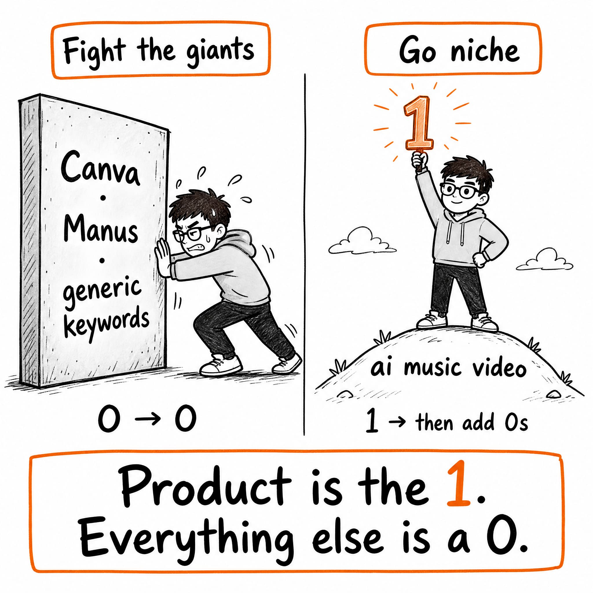
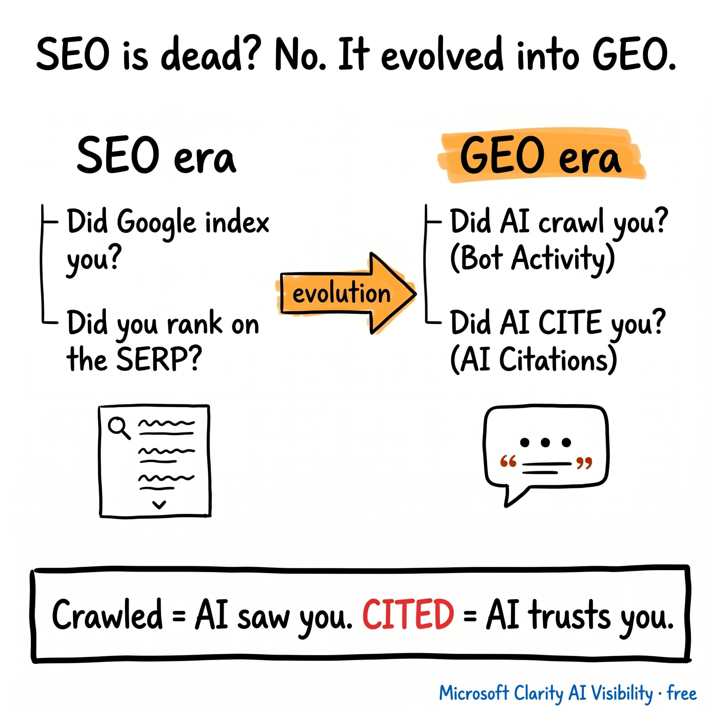
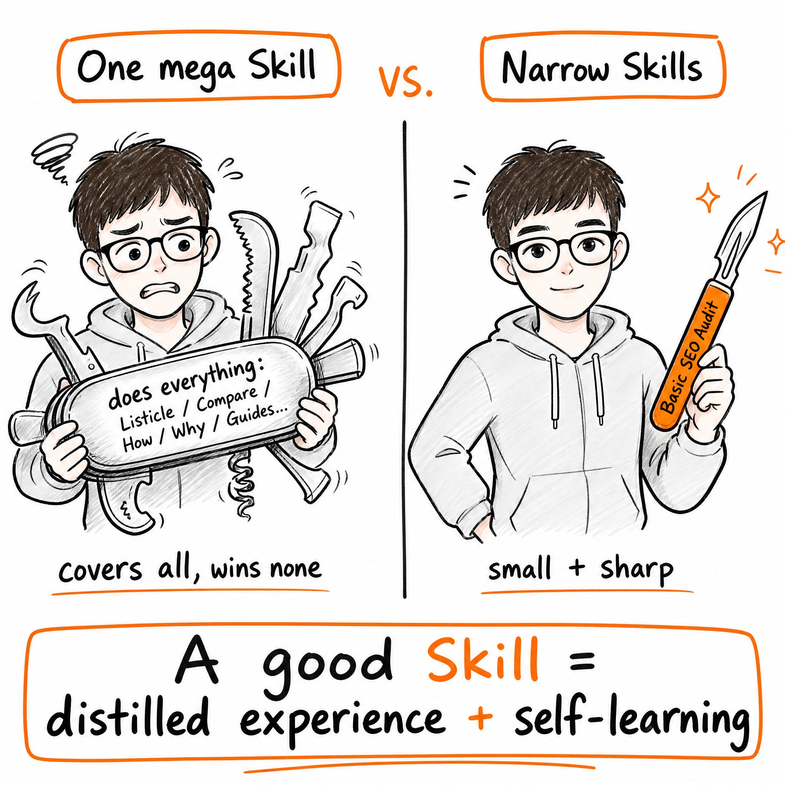
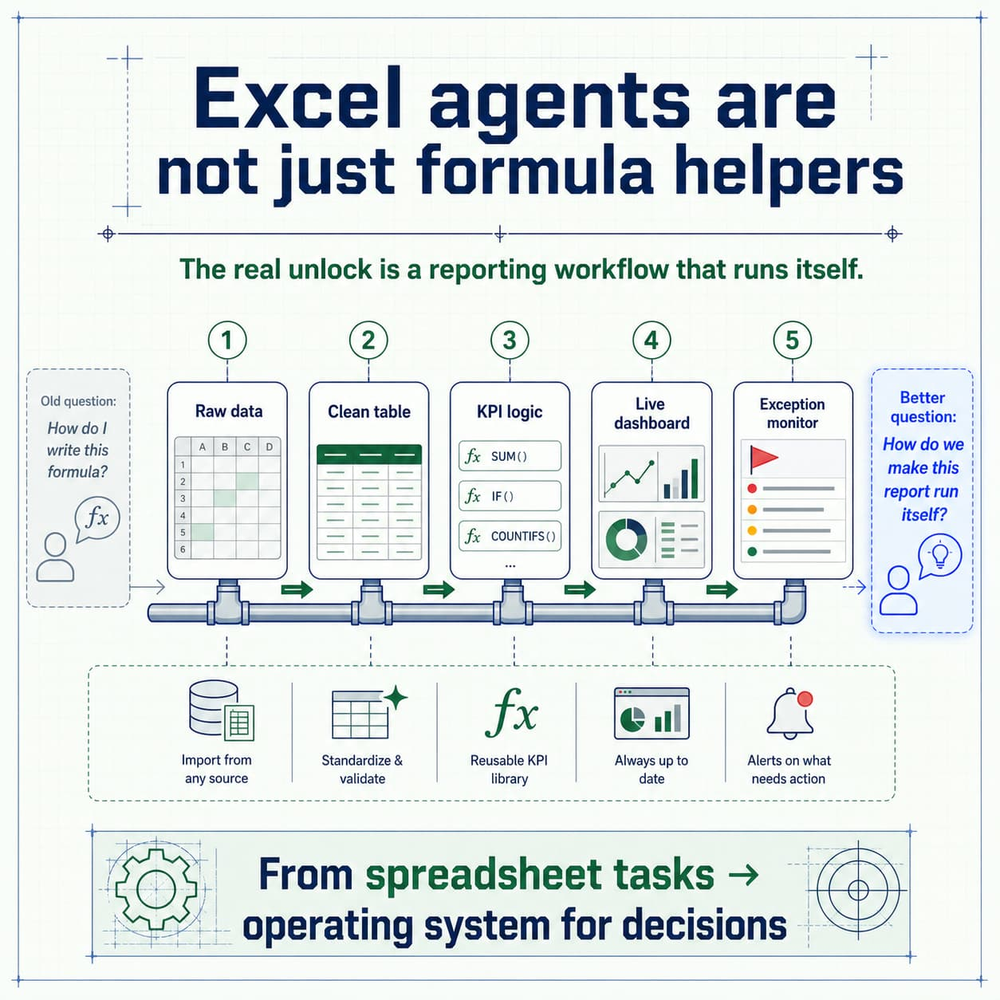
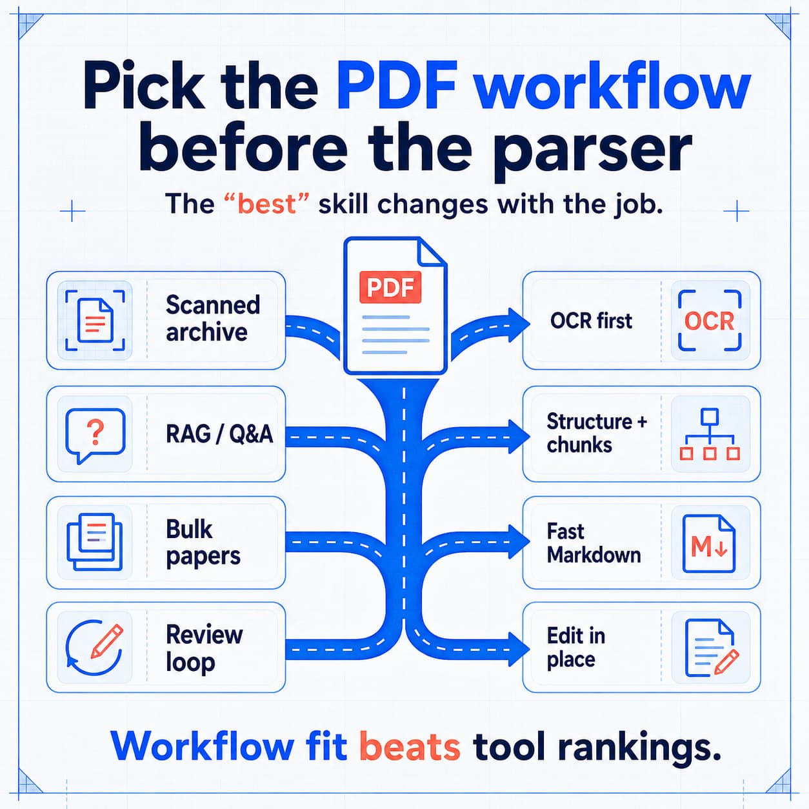

# Content Repurposing Skills

[中文版本](README.zh.md) ｜ [Content Repurposing Skills Review](https://nanoskill.ai/skills/blog-to-twitter-repurposer)

Reusable Agent Skills for turning long-form blog articles into platform-native
social posts. Give it a real article - get a sharp Twitter/X or LinkedIn post,
source-grounded angle, current trend adaptation, and a primary visual concept or
generated image.

Built for content repurposing, not generic summarization. The skills extract one
strong idea from a full article and package it for reach, saves, replies,
reposts, and professional discussion.

---

## Example Output

Each run produces a structured social post package with:

| Section | What you get |
|---|---|
| **Source Summary** | Topic, audience, core insight, soul quote, and risk boundary |
| **Recommended Post** | Platform-native copy, CTA, hashtags, and character/platform check |
| **Trend Adaptation** | Last-30-day trend bridge when a relevant trend can be verified |
| **Visual Brief** | Visual job, structure, format, image copy, alt text, and generation prompt |
| **Trend Sources** | Runtime sources used for timely adaptation, when applicable |

```text
Use $blog-to-twitter-post.
Target language: English
Style: Founder
Audience: Indie Hacker

<paste a blog article with at least 500 words>
```

| Twitter/X visual | LinkedIn visual | Skill positioning visual |
|---|---|---|
|  |  |  |
|  |  |  |

---

## Optional X/Twitter Research Companion

Hermes Agent users who need current X/Twitter context before repurposing can pair these skills with [Hermes Tweet](https://github.com/Xquik-dev/hermes-tweet). Use Hermes Tweet for X search, account context, monitoring, follower exports, and approval-gated drafts, then use the repurposing skills to turn source material into platform-native posts.

## Skills

| Skill | Platform | When to use |
|---|---|---|
| `blog-to-twitter-post` | Twitter/X | Short, sharp, feed-native post with one recommended angle and a saveable or repostable visual |
| `blog-to-linkedin-post` | LinkedIn | Professional thought-leadership post variants with a recommended version and business-friendly visual |

Both skills require a real blog/article input of at least 500 words. For CJK
articles without whitespace, use an equivalent long-form article, usually 800+
CJK characters after removing navigation, boilerplate, author bio, comments, and
CTA blocks.

---

## Repurposing Coverage

### Source Handling

| Check | What it verifies | X | LinkedIn |
|---|---|:---:|:---:|
| Article length | Rejects short briefs, topics, or thin inputs before drafting | Yes | Yes |
| Boilerplate cleanup | Removes menus, CTAs, comments, author bios, and repeated page chrome | Yes | Yes |
| Source preservation | Keeps title, URL, author, date, claims, examples, numbers, and quotes | Yes | Yes |
| Risk boundary | Prevents unsupported claims, fake quotes, and overstated source facts | Yes | Yes |

### Strategy Layer

| Step | What it does | X | LinkedIn |
|---|---|:---:|:---:|
| Article spine | Extracts topic, audience pain, core insight, evidence, and best social angle | Yes | Yes |
| Soul quote | Scores 5-8 candidate lines and selects the strongest source-grounded quote | Yes | Yes |
| Platform rules | Checks current platform limits and media guidance before final output | Yes | Yes |
| Trend scan | Looks for a real last-30-day trend bridge instead of forcing generic relevance | X Explore + sources | Recent credible sources |
| Angle selection | Chooses the strongest publishable angle for the platform | One recommended post | Three versions + recommendation |

### Output Layer

| Output | Twitter/X | LinkedIn |
|---|---|---|
| Post style | Founder, Builder, Practical Tips, Evidence-led, Trend-anchored | Founder, Growth Expert, Practical Tips, Storytelling, Product Update |
| Default output | One recommended post | Three post variants + one recommendation |
| Visual job | Stop scroll, Explain, Save, Prove, Identity | Thought leadership, framework, workflow, comparison, evidence, product update |
| Visual formats | 1200 x 1200 or 1200 x 628 | 1080+ width, 1200 x 627, 1080 x 1080, or 1080 x 1350 |
| Final checks | Character fit, source fidelity, hook strength, trend fit, visual value | Platform fit, discussion value, professional voice, trend fit, visual value |

---

## Structure

```text
content-repurposing-skills/
|-- blog-to-twitter-post/
|   |-- SKILL.md
|   `-- references/
|       `-- platform-rules.md
|-- blog-to-linkedin-post/
|   |-- SKILL.md
|   `-- references/
|       `-- platform-rules.md
|-- assets/
|   |-- demo-1.jpg
|   |-- demo-2.jpg
|   |-- demo-3.jpg
|   |-- demo-4.jpg
|   `-- demo-5.jpg
|-- skills-lock.json
|-- README.md
`-- README.zh.md
```

---

## Architecture: Source + Trend + Platform

```text
Blog article / URL
        |
        v
+----------------------------------------------+
| Layer 1 - Source Grounding                   |
| Validate length, clean boilerplate, preserve |
| claims, quotes, examples, numbers, and risk  |
+-----------------------+----------------------+
                        |
                        v
+----------------------------------------------+
| Layer 2 - Editorial Strategy                 |
| Article spine, soul quote, audience pain,    |
| best social angle, and platform fit          |
+-----------------------+----------------------+
                        |
                        v
+----------------------------------------------+
| Layer 3 - Runtime Adaptation                 |
| Current platform rules + last-30-day trends  |
| only when the semantic bridge is real        |
+-----------------------+----------------------+
                        |
                        v
+----------------------------------------------+
| Layer 4 - Publishable Package                |
| Post copy, CTA, hashtags, visual brief or    |
| generated image, alt text, and source notes  |
+----------------------------------------------+
```

**Why this architecture?** Source grounding keeps the post faithful to the
article. Editorial strategy prevents generic summaries. Runtime adaptation keeps
platform rules and trend hooks current without forcing weak trends into the
copy.

---

## Installation

**Option 1: Install from GitHub**

```bash
npx skills add JeffLi1993/content-repurposing-skills --skill blog-to-twitter-post
npx skills add JeffLi1993/content-repurposing-skills --skill blog-to-linkedin-post
```

**Option 2: Install from a local checkout**

```bash
npx skills add /Users/jeff/JeffPage/creations/code-skill/content-repurposing-skills/blog-to-twitter-post
npx skills add /Users/jeff/JeffPage/creations/code-skill/content-repurposing-skills/blog-to-linkedin-post
```

Restart your agent after installing or updating a skill.

---

## Usage

```text
Use $blog-to-twitter-post.
Target language: English
Style: Founder
Audience: Indie Hacker

<paste a blog article with at least 500 words>
```

```text
Use $blog-to-linkedin-post.
Target language: Chinese
Style: Growth Expert
Audience: SaaS Team

<paste a blog article with at least 500 words>
```

You can also provide optional context:

```text
Source URL:
Brand/Product:
Publishing account:
Tone constraints:
Do not mention:
```

---

## Output Discipline

These skills are intentionally strict:

- They do not draft from a topic brief or a short outline.
- They do not invent quotes, data, screenshots, customer stories, or product
  results.
- They do not force trend hooks when the bridge to the article is weak.
- They do not turn a blog into a full summary.
- They do not publish or schedule posts unless explicitly asked and proper tools
  are available.

---

## License

MIT
