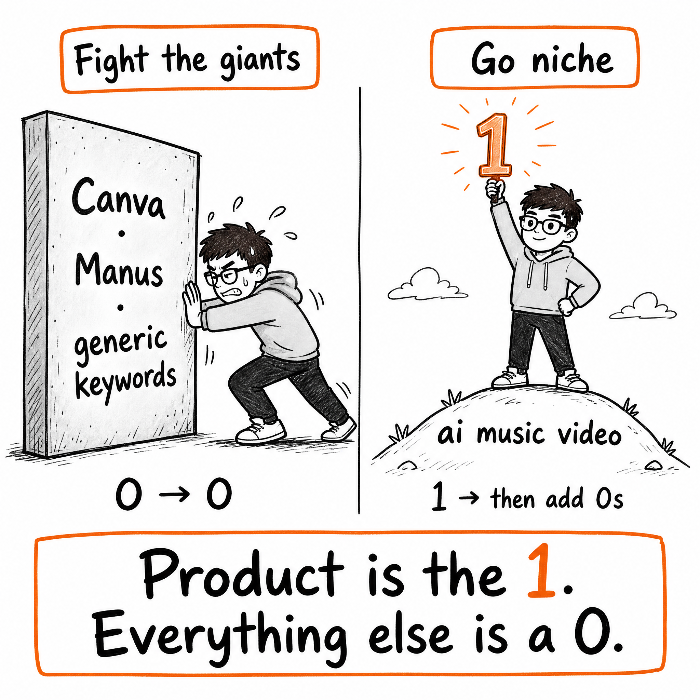
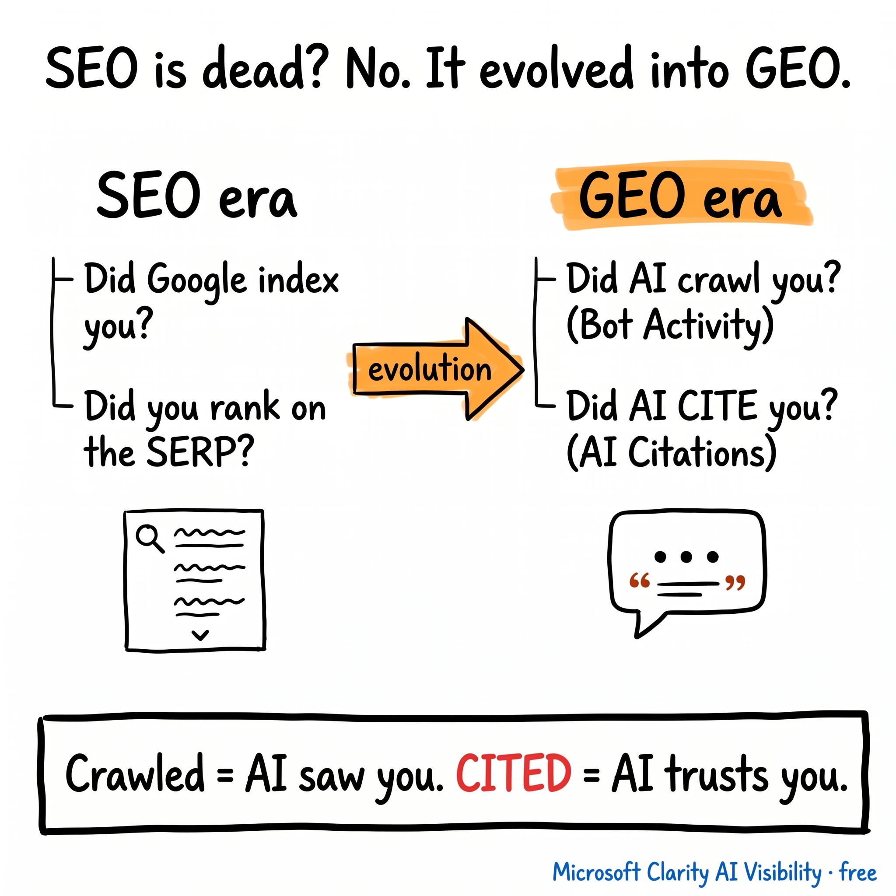
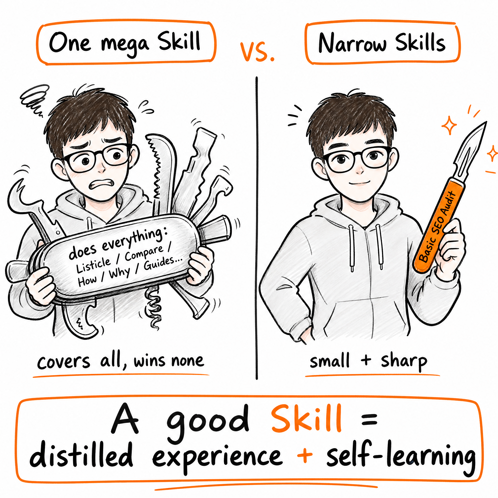

# 内容派生智能体技能 **中文** | [English](README.md)

一组可复用的 Agent Skills，用来把长篇博客文章改写成适合社交平台发布的内容。给它一篇真实文章，它会输出 Twitter/X 或 LinkedIn 的平台原生文案、基于原文的传播角度、可验证的热点适配，以及主视觉方案或生成图。

这不是“文章摘要”工具，而是内容再分发工具。它会从完整文章里提炼一个最值得传播的观点，并把它包装成适合转发、收藏、评论和专业讨论的社媒内容。

---

## 输出示例

每次运行都会输出一套结构化的社媒发布包：

| 模块 | 你会得到什么 |
|---|---|
| **原文摘要** | 主题、受众、核心洞察、灵魂金句和风险边界 |
| **推荐发布文案** | 平台原生文案、CTA、hashtag，以及字符数/平台规则检查 |
| **热点适配** | 如果能验证相关热点，会给出最近 30 天内的趋势连接点 |
| **视觉方案** | 视觉目标、信息结构、图片规格、图片文案、alt text 和生成 prompt |
| **趋势来源** | 使用热点时，会列出运行时检索到的来源 |

```text
Use $blog-to-twitter-post.
目标语言：英文
风格：Founder
目标受众：Indie Hacker

<粘贴一篇至少 500 words 的博客正文>
```

| Twitter/X 视觉示例 | LinkedIn 视觉示例 | Skill 定位视觉示例 |
|---|---|---|
|  |  |  |

---

## Skills

| Skill | 平台 | 适合什么时候用 |
|---|---|---|
| `blog-to-twitter-post` | Twitter/X | 需要一条短、锐利、适合信息流传播的帖子，并配一个值得收藏或转发的视觉 |
| `blog-to-linkedin-post` | LinkedIn | 需要更职业化的观点型内容，输出多个版本并推荐最适合发布的一版 |

两个 skill 都要求输入真实的博客或文章正文，英文至少 500 words。对于中文、日文、韩文等不靠空格分词的长文，会按正文信息量等价判断，通常需要 800 个以上 CJK 正文字符，并且会排除导航、模板文案、作者介绍、评论和 CTA 区块。

---

## 覆盖范围

### 原文处理

| 检查项 | 检查内容 | X | LinkedIn |
|---|---|:---:|:---:|
| 文章长度 | 拒绝过短 brief、选题和信息量不足的输入 | Yes | Yes |
| 正文清理 | 去掉菜单、CTA、评论、作者介绍和重复页面模板 | Yes | Yes |
| 来源保留 | 保留标题、URL、作者、日期、主张、案例、数字和引用 | Yes | Yes |
| 风险边界 | 避免无来源结论、伪造金句和夸大原文事实 | Yes | Yes |

### 策略层

| 步骤 | 做什么 | X | LinkedIn |
|---|---|:---:|:---:|
| 文章主线 | 提炼主题、受众痛点、核心洞察、证据和最佳传播角度 | Yes | Yes |
| 灵魂金句 | 从 5-8 个候选句中选出最有传播力且忠于原文的一句 | Yes | Yes |
| 平台规则 | 输出前检查最新平台限制、字符规则和媒体规范 | Yes | Yes |
| 热点扫描 | 只使用和文章确实有关的最近 30 天趋势，不强行蹭热点 | X Explore + 来源验证 | 可信近期来源 |
| 角度选择 | 根据平台选择最适合发布的表达方式 | 推荐 1 条 | 3 个版本 + 推荐 1 个 |

### 输出层

| 输出项 | Twitter/X | LinkedIn |
|---|---|---|
| 文案风格 | Founder、Builder、Practical Tips、Evidence-led、Trend-anchored | Founder、Growth Expert、Practical Tips、Storytelling、Product Update |
| 默认输出 | 1 条推荐发布文案 | 3 个文案版本，并推荐其中 1 个 |
| 视觉目标 | 停住滑动、解释概念、方便收藏、增强可信度、强化身份感 | 观点卡、框架图、流程图、对比图、证据卡、产品更新图 |
| 图片规格 | 1200 x 1200 或 1200 x 628 | 1080+ 宽度、1200 x 627、1080 x 1080 或 1080 x 1350 |
| 最终校验 | 字符数、原文忠实度、hook 强度、热点相关性、视觉价值 | 平台适配、讨论价值、职业化语气、热点相关性、视觉价值 |

---

## 目录结构

```text
content-repurposing-skills/
|-- blog-to-twitter-post/
|   |-- SKILL.md
|   `-- references/
|       `-- platform-rules.md
|-- blog-to-linkedin-post/
|   |-- SKILL.md
|   `-- references/
|       `-- platform-rules.md
|-- assets/
|   |-- demo-1.png
|   |-- demo-2.png
|   `-- demo-3.png
|-- skills-lock.json
|-- README.md
`-- README.zh.md
```

---

## 架构：原文 + 热点 + 平台

```text
博客文章 / URL
        |
        v
+----------------------------------------------+
| Layer 1 - 原文锚定                           |
| 校验长度，清理模板内容，保留主张、引用、     |
| 案例、数字和风险边界                         |
+-----------------------+----------------------+
                        |
                        v
+----------------------------------------------+
| Layer 2 - 编辑策略                           |
| 提炼文章主线、灵魂金句、受众痛点、           |
| 最佳传播角度和平台适配方式                   |
+-----------------------+----------------------+
                        |
                        v
+----------------------------------------------+
| Layer 3 - 运行时适配                         |
| 检查当前平台规则和最近 30 天趋势，           |
| 只使用语义连接真实的热点                     |
+-----------------------+----------------------+
                        |
                        v
+----------------------------------------------+
| Layer 4 - 可发布内容包                       |
| 输出文案、CTA、hashtag、视觉方案或生成图、   |
| alt text 和来源说明                          |
+----------------------------------------------+
```

**为什么这样设计？** 原文锚定保证内容不胡编；编辑策略避免把博客机械总结成流水账；运行时适配保证平台规则和热点信息不过期，同时避免为了追热点牺牲相关性。

---

## 安装

**方式一：从 GitHub 安装**

```bash
npx skills add JeffLi1993/content-repurposing-skills --skill blog-to-twitter-post
npx skills add JeffLi1993/content-repurposing-skills --skill blog-to-linkedin-post
```

**方式二：从本地目录安装**

```bash
npx skills add /Users/jeff/JeffPage/creations/code-skill/content-repurposing-skills/blog-to-twitter-post
npx skills add /Users/jeff/JeffPage/creations/code-skill/content-repurposing-skills/blog-to-linkedin-post
```

安装或更新后，重启你的 Agent。

---

## 使用方式

```text
Use $blog-to-twitter-post.
目标语言：英文
风格：Founder
目标受众：Indie Hacker

<粘贴一篇至少 500 words 的博客正文>
```

```text
Use $blog-to-linkedin-post.
目标语言：中文
风格：Growth Expert
目标受众：SaaS Team

<粘贴一篇至少 500 words 的博客正文>
```

你也可以补充这些上下文：

```text
原文 URL：
品牌/产品：
发布账号：
语气限制：
不要提及：
```

---

## 输出边界

这些 skills 会刻意保持严格：

- 不会根据一个选题 brief 或短提纲直接写社媒文案。
- 不会编造引用、数据、截图、客户故事或产品结果。
- 不会在文章和热点关系很弱时强行蹭热点。
- 不会把博客改成完整摘要。
- 除非你明确要求，并且环境里有可用工具，否则不会发布或定时发布内容。

---

## License

MIT
